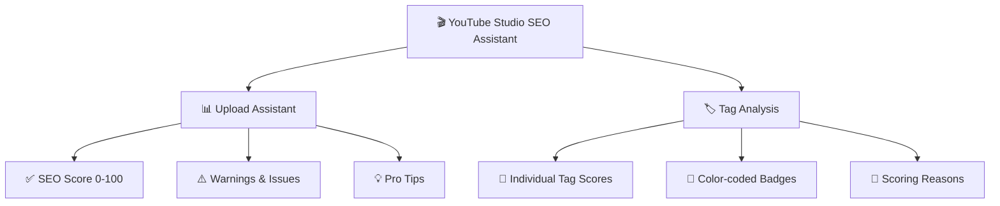

# 📊 YouTube Studio SEO Assistant

<p align="center">
  
  
  
  
</p>

<p align="center">
  
  
</p>

<p align="center">
  
  
  
</p>

<p align="center">
  <b>Real-time SEO analysis & optimization for YouTube Studio with inline tag scoring</b>
</p>

---

## 🎯 What is This?

**YouTube Studio SEO Assistant** provides powerful tools to optimize your videos:

- 📊 **SEO Score Analysis** - Real-time scoring (0-100) for your video
- 🏷️ **Tag SEO Scoring** - Individual SEO scores for each tag with inline badges
- ⚠️ **Issue Detection** - Identifies missing thumbnails, short descriptions, etc.
- 💡 **Pro Tips** - Actionable suggestions to improve discoverability

---

## 📈 Features Comparison



| Feature | Description | Points |
|---------|-------------|--------|
| 🏷️ **Tag in Title** | Tag appears in video title | +30 |
| 📝 **Tag in Description** | Tag appears in description | +15 |
| 🎯 **Long-tail Keyword** | 3+ words (more specific) | +20 |
| 📏 **Good Length** | 10-30 characters optimal | +15 |
| ⭐ **Primary Tag** | First tag bonus | +10 |
| 📅 **Has Year** | Contains 2024/2025/2026 | +5 |

---

## 🎨 Color Coding

| Score | Color | Status |
|-------|-------|--------|
| 70-100 | 🟢 Green | Excellent SEO |
| 50-69 | 🟠 Orange | Good, can improve |
| 30-49 | 🟠 Dark Orange | Needs work |
| 0-29 | 🔴 Red | Poor SEO |

---

## 📦 Installation

### Quick Start

```bash
# Clone the repository
git clone https://github.com/rajmehto/youtube-analytics.git

# Navigate to folder
cd youtube-analytics
```

### Load in Chrome

1. Open `chrome://extensions/`
2. Enable **Developer Mode** (top right toggle)
3. Click **Load unpacked**
4. Select the `youtube-analytics` folder
5. Done! Go to YouTube Studio 🎉

---

## 🖥️ Screenshots

### Upload Assistant Panel
```
┌─────────────────────────────┐
│  📊 Upload Assistant    [-] │
├─────────────────────────────┤
│         ╭───────╮           │
│         │  75   │           │
│         │ Score │           │
│         ╰───────╯           │
├─────────────────────────────┤
│ 🚨 CRITICAL ISSUES (1)      │
│ ┌─────────────────────────┐ │
│ │ Thumbnail               │ │
│ │ No custom thumbnail     │ │
│ └─────────────────────────┘ │
├─────────────────────────────┤
│ ✅ STRENGTHS (2)            │
│ • Category: Entertainment   │
│ • Good number of tags (12)  │
└─────────────────────────────┘
```

### Inline Tag Badges
```
[gaming tutorial 75] [minecraft tips 2024 85] [how to build 60]
```

---

## 🛠️ Tech Stack

| Technology | Usage |
|------------|-------|
|  | Core Logic |
|  | Styling |
|  | Platform |
|  | Extension Format |

---

## 📁 Project Structure

```
youtube-analytics/
├── 📄 manifest.json          # Extension config
├── 📄 popup.html             # Popup UI
├── 📁 scripts/
│   ├── 📄 studio-content.js  # Main YouTube Studio script
│   ├── 📄 seo-analyzer.js    # SEO analysis logic
│   ├── 📄 content.js         # Watch page script
│   └── 📄 background.js      # Service worker
├── 📁 styles/
│   ├── 📄 studio-assistant.css
│   └── 📄 overlay.css
└── 📁 icons/
    └── 🖼️ icon16/48/128.png
```

---

## 🚀 Roadmap

- [x] Real-time SEO scoring
- [x] Tag SEO analysis with badges
- [x] Category detection
- [x] Thumbnail detection
- [ ] Competitor analysis
- [ ] Trend suggestions
- [ ] A/B title testing
- [ ] Export analytics

---

## 🤝 Contributing

Contributions welcome! Feel free to:

- 🐛 Report bugs
- 💡 Suggest features  
- 🔧 Submit PRs

---

## 📄 License

```
MIT License - Feel free to use and modify
```

---

<p align="center">
  <b>Made with ❤️ for YouTube Creators</b>
</p>

<p align="center">
  <a href="https://github.com/rajmehto">⭐ Star this repo if it helped you!</a>
</p>
